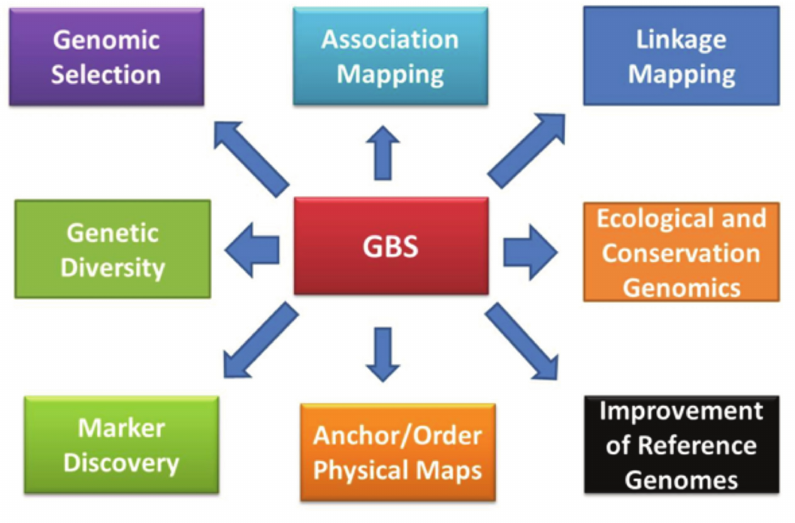
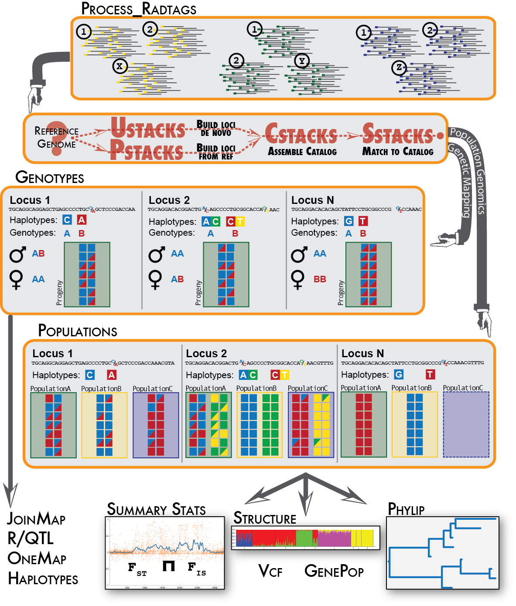
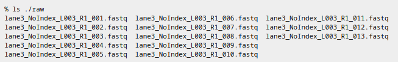
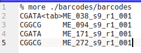
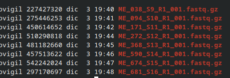
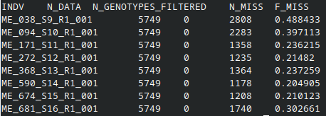

# <a href="#" class="btn btn-primary btn-lg">**APLICACIONES**</a>
<div>
<p style = 'text-align:center;'>

</p>
</div>

# <a href="#" class="btn btn-primary btn-lg">**PIPELINE GBS-PROCESING**</a>
<div>
<p style = 'text-align:center;'>

</p>
</div>


# <a href="#" class="btn btn-primary btn-lg">**STACKS**</a>

[Descargar](https://catchenlab.life.illinois.edu/stacks/)

[Instalar-manual](https://catchenlab.life.illinois.edu/stacks/manual/#install)

<div>
<p style = 'text-align:center;'>

</p>
</div>

# <a href="#" class="btn btn-primary btn-lg">**DEMULTIPLEXACIÓN - FILTRADO - STACKS**</a>

[**process_radtags**](https://catchenlab.life.illinois.edu/stacks/manual-v1/)

## **1.RawData**
<div>
<p style = 'text-align:center;'>

</p>
</div>
## **2.Barcodes para cada individuo**
<div>
<p style = 'text-align:center;'>

</p>
</div>
## **3.Demultiplexado o individualización**
<div>
<p style = 'text-align:center;'>

</p>
</div>

# <a href="#" class="btn btn-primary btn-lg">**ALINEAMIENTO A GENOMA DE REFERENCIA**</a>

## **1.INSTALACIÓN DE PROGRAMAS**
  
  BWA - BORROWS WHEELER ALIGNER
```{}
sudo apt-get update
sudo apt-get install bwa
```
  SAMTOOLS
```{}
sudo apt-get update
sudo apt-get install samtools
```
## **2.INDEXADO DEL GENOMA DE REFERENCIA**
```{}
#!/bin/bash
src="/home/bvigil/GBS_SEMINARIO/genoma"
bwa index -p manihot-index -a bwtsw $src/GCF_001659605.2_M.esculenta_v8_genomic.fna
```
## **3.ALINEAMIENTO**
```{}
#!/bin/bash
src="/home/bvigil/GBS_SEMINARIO/"
bwa_db="/home/bvigil/GBS_SEMINARIO/genoma/manihot-index"

files="ME_038_S9_R1_001
ME_094_S10_R1_001
ME_171_S11_R1_001
ME_272_S12_R1_001
ME_368_S13_R1_001
ME_590_S14_R1_001
ME_674_S15_R1_001
ME_681_S16_R1_001"

for ME in $files
do
        bwa mem -t 12 $bwa_db $src/data/${ME}.fastq.gz > $src/alineamiento/${ME}.sam
done

```
## **4.SAM --> BAM**
```{}
#!/bin/bash
src="/home/bvigil/GBS_SEMINARIO/"

files="ME_038_S9_R1_001
ME_094_S10_R1_001
ME_171_S11_R1_001
ME_272_S12_R1_001
ME_368_S13_R1_001
ME_590_S14_R1_001
ME_674_S15_R1_001
ME_681_S16_R1_001"

for ME in $files
do
        samtools view -b -S $src/alineamiento/${ME}.sam -o $src/alineamiento/${ME}.bam
done
```
## **5.SORT** 
```{}
#!/bin/bash
src="/home/bvigil/GBS_SEMINARIO/alineamiento/"

files="ME_038_S9_R1_001
ME_094_S10_R1_001
ME_171_S11_R1_001
ME_272_S12_R1_001
ME_368_S13_R1_001
ME_590_S14_R1_001
ME_674_S15_R1_001
ME_681_S16_R1_001"

for ME in $files
do
        samtools sort $src/${ME}.bam -o $src/sort/${ME}.bam
done
```

# <a href="#" class="btn btn-primary btn-lg">**GSTACKS - STACKS**</a>

```{}
#!/bin/bash

src="/home/bvigil/GBS_SEMINARIO"
gstacks -I $src/alineamiento/sort/ -M $src/scripts/popmap-yuca-piloto -O $src/stacks -t 24
```

# <a href="#" class="btn btn-primary btn-lg">**POPULATIONS - VCF**</a>
**SNP-CALLING**
```{}
#!/bin/bash

src="/home/bvigil/GBS_SEMINARIO"
populations -P $src/stacks/ -M $src/scripts/popmap-yuca-piloto --vcf --plink -t 24
```

# <a href="#" class="btn btn-primary btn-lg">**FORMATO**</a>
[VCF](https://samtools.github.io/hts-specs/VCFv4.2.pdf)

VCF es un formato de archivo de texto (lo más probable es que se almacene de forma comprimida). Contiene líneas de metainformación, una línea de encabezado y luego líneas de datos, cada una de las cuales contiene información sobre una posición en el genoma. El formato también tiene la capacidad de contener información de genotipo en muestras para cada posición.

<div>
<p style = 'text-align:center;'>

</p>
</div>

# <a href="#" class="btn btn-primary btn-lg">**PROGRAMAS -FILTRADO DE SNPs**</a>
## **1.VCFTOOLS**
```{}
sudo apt-get update
sudo apt-get install vcftools
```
## **2.BCFTOOLS**
```{}
sudo apt-get update
sudo apt-get install bcftools
```

# <a href="#" class="btn btn-primary btn-lg">**DESCARGAR ARCHIVO - DEMO**</a>

Descargar [archivo VCF](https://drive.google.com/drive/folders/18xm4UcUeKhOCNCGLsWXVWW3jCQtKgwoV?usp=sharing)

<div>
<p style = 'text-align:center;'>

</p>
</div>

# <a href="#" class="btn btn-primary btn-lg">**FILTRADO A NIVEL DE LOCI-VARIANTE-SNP**</a>

Solo se mantendran a variantes que se hayan genotipado con éxito en el 50% de los individuos de nuestra población.

```{bash}
vcftools --vcf /home/bvigil/GBS_SEMINARIO/stacks/yuca.chr14.recode.vcf --max-missing 0.5 --recode --recode-INFO-all --out /home/bvigil/GBS_SEMINARIO/stacks/yuca.chr14.maxmissing0.5 
```

# <a href="#" class="btn btn-primary btn-lg">**FILTRADO POR INDIVIDUOS**</a>

Este paso es para eliminar a los individuos que no se secuenciaron bien, que presentan datos faltantes por loci. Esto se realiza evaluando los niveles individuales de datos faltantes.

```{bash}
vcftools --vcf /home/bvigil/GBS_SEMINARIO/stacks/yuca.chr14.maxmissing0.5.recode.vcf --missing-indv
```

revisamos el out.imiss

<div>
<p style = 'text-align:center;'>

</p>
</div>

Observamos la data faltante por individuo en un histograma

```{}
#!/bin/bash

mawk '!/IN/' /home/bvigil/GBS_SEMINARIO/stacks/out.imiss | cut -f5 > /home/bvigil/GBS_SEMINARIO/stacks/totalmissing
gnuplot << \EOF 
set terminal dumb size 120, 30
set autoscale 
unset label
set title "Histogram of % missing data per individual"
set ylabel "Number of Occurrences"
set xlabel "% of missing data"
#set yr [0:100000]
binwidth=0.01
bin(x,width)=width*floor(x/width) + binwidth/2.0
plot 'totalmissing' using (bin($1,binwidth)):(1.0) smooth freq with boxes
pause -1
EOF
```

```{}
./hist_miss.sh
```

<div>
<p style = 'text-align:center;'>

</p>
</div>

# <a href="#" class="btn btn-primary btn-lg">**FILTRADO POR FRECUENCIA DE ALELO MENOR - MAF**</a>

Este filtrado es importante y depende de los objetivos del estudio, el tipo y la cantidad de individuos de la población. Por lo general se hace un filtrado de maf 0.01, esto significa que se eliminaran aquellos loci cuyo alelo menor tenga una frecuencia menor al 1%.

```{bash}
vcftools --vcf /home/bvigil/GBS_SEMINARIO/stacks/yuca.chr14.maxmissing0.5.recode.vcf --maf 0.01 --recode --recode-INFO-all --out /home/bvigil/GBS_SEMINARIO/stacks/yuca.chr14.maxmissing0.5.maf0.01
```


